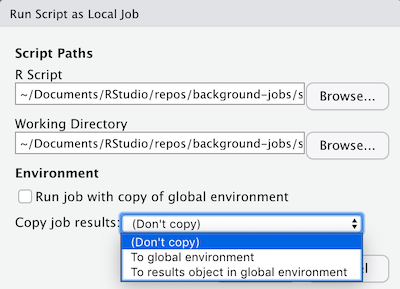

Local Job environment options
================

When a local job is run, a popup like the one below is shown:



This window provides several options about how to run the job. The
**Environment** section of the window contains options for handling the
environment of the background job. A background job can be run with a
copy of the global environment of the active R session, which is useful
if the job depends on variables or functions defined in the current
global environment. By default, the state of a background R process is
discarded when the job is completed. However, there are options to copy
job results into the global environment or to copy job results into a
new environment. *If job results are copied into the global environment,
they will silently overwrite any objects with the same names.*

This example contains two scripts used to highlight how the options
described above impact background jobs.

## Setup

The [`setup.R`](setup.R) script sets up a global environment with 3
variables: `x`, `y`, and `z`.

``` r
x <- 1
y <- "a"
z <- rnorm(10)
```

With this setup, [`simple.R`](simple.R) can be run as a background job,
with various environment options enabled in order to understand how each
option impacts the background job and the global environment.


